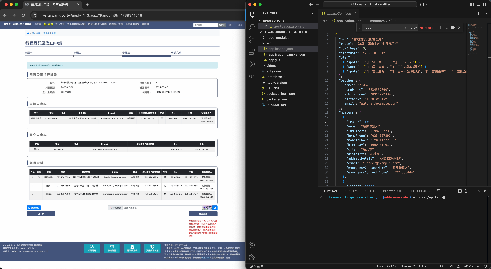

# taiwan-hiking-form-filler 🏔️

A CLI/script tool that auto-fills Taiwan National Park hiking permit application forms — saving you time, keystrokes, and typos.  
⚠️ **This tool does not submit the form or bypass the reCAPTCHA.**

## 🎥 Demo

👉 [Watch full demo video on YouTube](https://youtu.be/_c_niUu43xU)

[](https://youtu.be/_c_niUu43xU)

---

## 🔍 What it does

This tool helps you auto-fill the long and repetitive hiking application forms on [https://hike.taiwan.gov.tw](https://hike.taiwan.gov.tw), especially useful for:

- Frequent hikers who apply regularly
- Group leaders filling out multiple teammate details
- Reducing typo-prone copy-paste workflows

---

## 🚫 What it **does NOT** do

- ❌ Does **not** submit the form
- ❌ Does **not** solve or bypass reCAPTCHA
- ❌ Does **not** guarantee acceptance from the park

You’ll still review, solve the CAPTCHA, and submit manually.

---

## 🛠️ How to use

> Requires Node.js (v20+)

### Install

```bash
git clone https://github.com/hiiamyes/taiwan-hiking-form-filler.git
cd taiwan-hiking-form-filler
npm i
npx playwright install
```

### Run form filler

```bash
cp src/application.sample.json src/application.json
node src/apply.js
```

## Chrome extension

The `extension/` directory is a direct Chrome-extension version of
`src/apply.js`.

1. Prepare a JSON file containing `watcher` and `members`.
2. Open `chrome://extensions`, enable **Developer mode**, and click
   **Load unpacked**.
3. Select the repository's `extension/` directory.
4. Click the extension icon, select a route, start date, and member JSON file,
   then click **Start** to open the hiking application and start filling.

The extension stops on the final review page. Review the form, enter the
CAPTCHA, and submit it manually.
